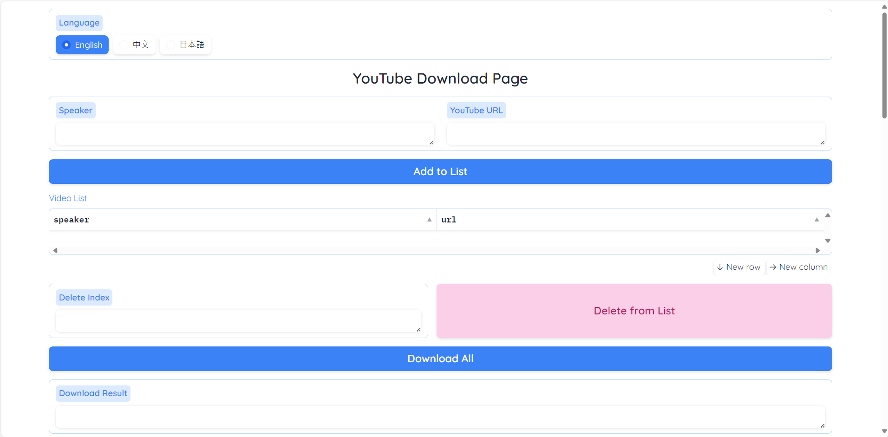
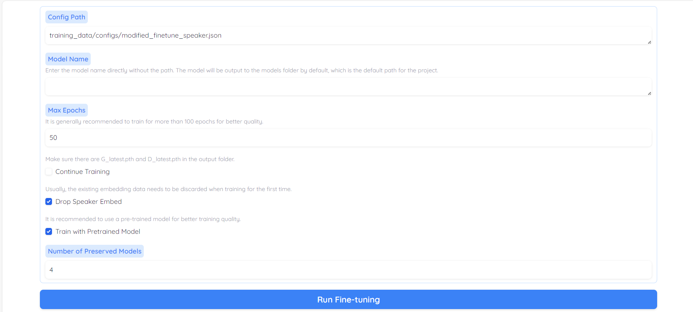

<div align="center">
<h1>Sherpa-Onnx-VITS-Fine-Tuning-WebUI</h1>

VITSの推論、訓練、およびSherpa-Onnx形式での出力を統合したワンページWebUI

[](.)
[](.)
[](./LICENSE)
[](.)

[**English**](../README.md) | [**正體中文**](README-zh.md) | **日本語**

</div>

---

# 紹介
本プロジェクトは、簡単に操作できるワンページのWebUIを提供し、自分の音声ファイルを使用してVITSモデルを訓練し、推論結果をテストし、Sherpa-Onnxフレームワークで使用できるOnnxモデル形式で出力することができます。この技術は、Plachtaaが開発した[VITS-fast-fine-tuning](https://github.com/Plachtaa/VITS-fast-fine-tuning)と、Kaldiチームが開発した[Sherpa-Onnx](https://github.com/k2-fsa/sherpa-onnx)に基づいています。

本プロジェクトの開発目標は、自分の音声モデルをより簡単に訓練できるようにし、AndroidやiOSなどのモバイルプラットフォームで音声モデルを使用できるようにすることです。

> [!IMPORTANT]  
> 本プロジェクトはまだ開発段階にあるため、使用中にエラーやバグが発生する可能性があります。ご了承ください。ご連絡やissueの提供、解決策の提案を歓迎します。

## なぜVITSを使用するのか？
VITSはエンドツーエンドのテキスト音声合成（TTS）モデルであり、自然で感情豊かな音声合成を提供し、CPU推論でも優れたパフォーマンスを発揮します。本プロジェクトの立ち上げ時には、Bert-VITS2、GPT-SoVITS、FishSpeechなどのより優れたTTSモデルが存在しましたが、通常はGPU推論が必要であり、より多くのVRAMを消費します。VITS-fast-fine-tuningは、英語、中国語、日本語の音声訓練を提供します。

## なぜSherpa-Onnxを使用するのか？
Sherpa-Onnxフレームワークは、新世代のKaldiとonnxruntimeを使用して、音声からテキストへの変換、テキストから音声への変換、話者認識、VADを行い、インターネット接続を必要としません。組み込みシステム、Android、iOS、Raspberry Pi、RISC-V、x86_64サーバー、WebSocketサーバー/クライアント、C/C++、Python、Kotlin、C#、Go、NodeJS、Java、Swift、Dart、JavaScript、Flutter、Object Pascal、Lazarus、Rustをサポートします。したがって、VITSで訓練したモデル形式をSherpa-Onnxに変換することで、複数のプラットフォームでより効果的に使用できます。

# Todoリスト

- [x] **変換用スクリプトを提供。**
- [x] **操作可能なWebUIを提供。**
  - [x] ステップバイステップのトレーニング操作インターフェース。
  - [x] YouTubeからの音声の一括ダウンロードをサポート。
  - [x] 長い音声を短い音声に分割する機能をサポート。
  - [x] ノイズリダクション、whisper音声からテキストへの変換、ドキュメントの注釈をサポート。
  - [ ] VITSトレーニングをサポート。
  - [ ] 短い音声、長い音声、ビデオの3つの異なる形式の素材を使用したトレーニングをサポート。
  - [ ] トレーニング後にモデル推論を直接使用可能。
  - [x] PytorchモデルをSherpa-Onnxモデルに変換することをサポート。
  - [x] Sherpa-Onnxモデルの推論をサポート。
- [ ] すべてのインストールコマンドを自動実行するワンクリックインストールを提供。
- [ ] Huggingfaceオンラインデモを提供。
- [ ] Colabスクリプトを提供。

# インストールと使用方法
> [!TIP]  
> 本プロジェクトはPython 3.8バージョンを使用しています。他のバージョンでは問題が発生する可能性があります。

## 事前訓練済みモデルをSherpa-Onnx形式に変換する
### 1. 事前訓練済みモデルをダウンロードする
Linux
```bash
wget https://huggingface.co/spaces/zomehwh/vits-uma-genshin-honkai/resolve/main/model/G_953000.pth -P models/vits-uma-genshin-honkai
wget https://huggingface.co/spaces/zomehwh/vits-uma-genshin-honkai/resolve/main/model/config.json -P models/vits-uma-genshin-honkai
```
Windows
```bash
Invoke-WebRequest -Uri https://huggingface.co/spaces/zomehwh/vits-uma-genshin-honkai/resolve/main/model/G_953000.pth -OutFile models/vits-uma-genshin-honkai/G_953000.pth
Invoke-WebRequest -Uri https://huggingface.co/spaces/zomehwh/vits-uma-genshin-honkai/resolve/main/model/config.json -OutFile models/vits-uma-genshin-honkai/config.json
```

### 2. 仮想環境を作成する
```bash
python3 -m venv venv
```

### 3. 仮想環境を起動する
Linux
```bash
source venv/bin/activate
```
Windows
```bash
venv\Scripts\activate
```

### 4. 依存関係をインストールする
```bash
pip install -r requirements.txt
python vits_fast_fine_tuning/monotonic_align/setup.py build_ext
```

### 5. スクリプトを実行する

```bash
python export_vits_fast_fine_tuning_onnx.py --config ./models/vits-uma-genshin-honkai/config.json --checkpoint ./models/vits-uma-genshin-honkai/G_953000.pth
```
コマンドラインの利用可能なパラメータの説明
 - --config 必須 vitsのトレーニング完了後に生成されるconfigファイル。
 - --checkpoint 必須 vitsのトレーニング完了後に生成されるpytorchモデル。
 - --output_dir 任意 出力onnxモデルのフォルダ、デフォルトはonnx-output。
 - --comment 任意 onnxモデル内の注釈情報。
 - --language 任意 onnxモデル内の言語情報。
 - --model_name 任意 モデル名、主に出力フォルダ内にサブフォルダを作成する際の名前。

### 6. 出力結果
出力が成功すると、フォルダonnx-output内にモデル名のフォルダが見つかるはずです。フォルダ内には以下のファイルと構造が含まれており、これらのファイルはsherpa-onnxで使用されます。model.onnxは元のモデルで、model.int8.onnxは量子化されたモデルで、どちらか一方を選択できます。model-opt.onnxは最適化されたモデルで、現在のところsherpa-onnxがサポートしているかどうかは不明です。
```bash
│  date.fst
│  lexicon.txt
│  model-opt.onnx
│  model.int8.onnx
│  model.onnx
│  new_heteronym.fst
│  number.fst
│  phone.fst
│  tokens.txt
│
└─dict
    │  hmm_model.utf8
    │  idf.utf8
    │  jieba.dict.utf8
    │  README.md
    │  stop_words.utf8
    │  user.dict.utf8
    │
    └─pos_dict
            char_state_tab.utf8
            prob_emit.utf8
            prob_start.utf8
            prob_trans.utf8
```

### 7. インファレンス
```bash
python onnx_inference.py --checkpoint ./onnx-output/vits-uma-genshin-honkai/model.onnx --lexicon ./onnx-output/vits-uma-genshin-honkai/lexicon.txt --tokens ./onnx-output/vits-uma-genshin-honkai/tokens.txt
```
コマンドラインの利用可能なパラメータの説明
 - --checkpoint 必須 onnxモデル。
 - --lexicon 必須 モデルで使用される音素表。
 - --token 必須 モデルで使用されるシンボル表。
 - --text 任意 テキストから音声への変換に使用される内容。

## WebUIの起動
> [!NOTE]  
> 機能は開発中です。

```bash
python webui.py
```

### ユーザーインターフェース
<div align="center">
  
</div>

<div align="center">
  
</div>

<div align="center">
  
</div>

<div align="center">
  
</div>

## トレーニングコマンド
> [!NOTE]  
> 機能は開発中です。
```bash
# yt-dlpに変更しました。元々このプロジェクトで使用していたyoutube-dlは動画をダウンロードできなくなりました。
python scripts/download_video.py
# バグがあります
python scripts/video2audio.py
python scripts/denoise_audio.py
# 注意：whisperにはffmpegが必要です
python scripts/long_audio_transcribe.py --languages "C" --whisper_size large-v2
```

トレーニング中にffmpegが見つからない場合、以下のエラーメッセージが表示されることがあります。その場合は、ffmpegライブラリをインストールする必要があります。
```bash
DEBUG:torio._extension.utils:Loading FFmpeg
DEBUG:torio._extension.utils:Failed to load FFmpeg extension.
```

torchの[公式ドキュメント](https://pytorch.org/audio/2.3.0/installation.html)によると、以下の命名規則に従ってライブラリを探します。インストールに問題がある場合は、関連するファイルが見つかるかどうかを確認してください。
> FFmpegのインストールを検索する際、TorchAudioはバージョン番号を含むライブラリファイルを探します。つまり、libavutil.so.<VERSION>（Linux用）、libavutil.<VERSION>.dylib（macOS用）、およびavutil-<VERSION>.dll（Windows用）です。多くの一般的な事前ビルドされたバイナリはこの命名スキームに従いますが、一部のディストリビューションにはバージョン化されていないファイル名があります。FFmpegの検出に問題がある場合は、インストールされたライブラリファイルがこの命名スキームに従っているかどうかを確認し、それらがライブラリ検索パスにリストされているディレクトリの1つにあることを確認してください。

Windowsバージョンのffmpegをインストールするには、以下のGitHubからコンパイル済みのライブラリを見つけることができます。
https://github.com/BtbN/FFmpeg-Builds/releases

特に注意すべき点は、ライブラリを含むバージョンを探すことです。本プロジェクトで使用されるtorchaudioには、ffmpegのバージョン6、5、4が必要なため、以下のURLからダウンロードすることをお勧めします。
https://github.com/BtbN/FFmpeg-Builds/releases/download/latest/ffmpeg-n6.1-latest-win64-lgpl-shared-6.1.zip

